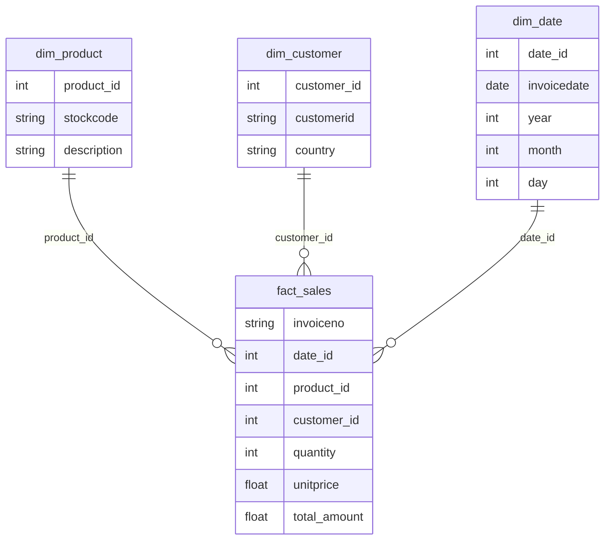
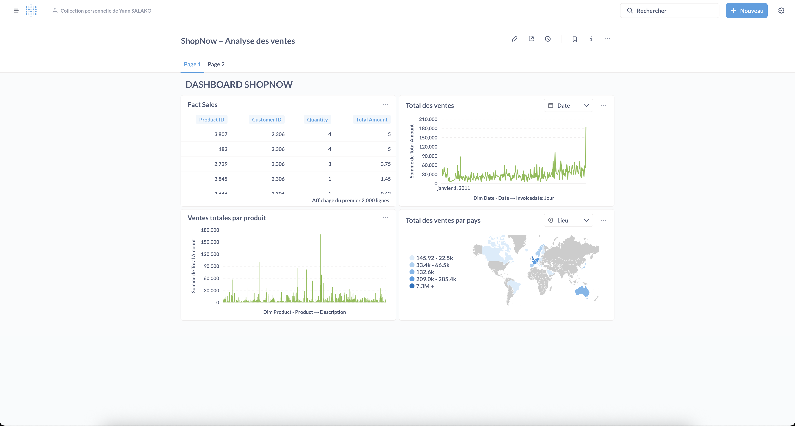
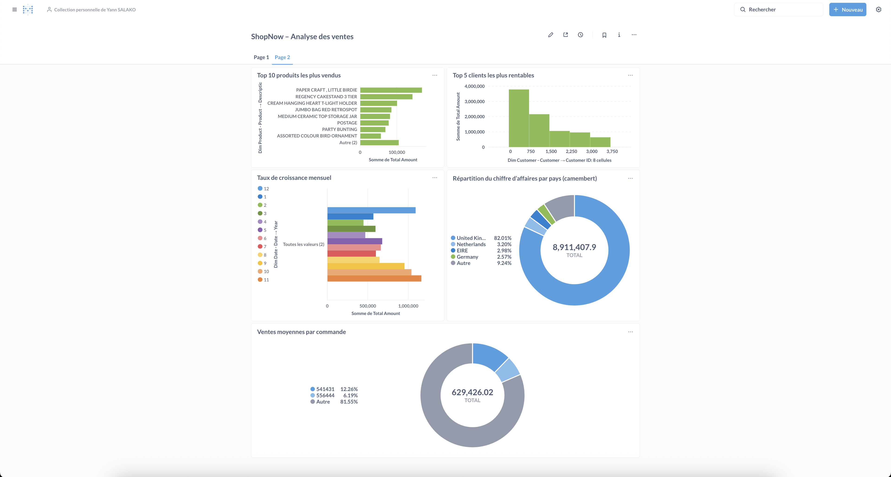

# 🏪 DWH ShopNow — Entrepôt de données E-commerce (PostgreSQL + Python + Metabase)


---

### 🚀 Projet complet de Data Engineering & Business Intelligence
Ce projet illustre la création d’un **entrepôt de données complet** à partir de données brutes CSV issues d’une activité e-commerce.  
L’objectif : **centraliser, transformer et analyser les ventes** à travers un pipeline **ETL automatisé** et un **dashboard interactif** sous Metabase.

---

## 🧠 Objectifs du projet

- Concevoir une architecture **Data Warehouse** robuste et scalable  
- Mettre en place un **pipeline ETL Python** (Extraction → Transformation → Chargement)  
- Structurer les données selon un **modèle en étoile**  
- Créer un **dashboard analytique** permettant de suivre les KPIs e-commerce :  
  - Chiffre d’affaires total et mensuel  
  - Top produits / pays / clients  
  - Panier moyen  
  - Répartition géographique des ventes  

---

## 🧩 Architecture générale

```
data.csv  →  staging.sales_raw  →  dwh.fact_sales + dwh.dim_*
                          ↓
                      Metabase (Docker)
                          ↓
                    Tableau de bord BI
```

---

## 📊 Modèle en étoile (Mermaid Diagram)



---

## ⚙️ Stack Technique

| Domaine | Technologies |
|----------|--------------|
| **ETL / Ingestion** | Python · Pandas · SQLAlchemy |
| **Stockage / DWH** | PostgreSQL |
| **Visualisation / BI** | Metabase (via Docker) |
| **DevOps / Environnement** | Docker Desktop · PostgresApp (macOS) |

---

## 📦 Structure du projet

```
dwh-shopnow/
│
├── data/
│   └── data.csv                      # Fichier source brut
│
├── etl_shopnow_python_pgsql/
│   └── main.py                       # Script ETL complet
│
├── docs/
│   └── dashboard_shopnow.png         # Capture du dashboard Metabase
│
├── README.md                         # Présentation du projet
```

---

## 🔁 Pipeline ETL

### Étapes principales :
1. **Extraction** : lecture du fichier CSV `data.csv`  
2. **Chargement brut** : insertion dans `staging.sales_raw`  
3. **Nettoyage / Transformation** :
   - Suppression des doublons et valeurs nulles  
   - Normalisation des champs (`invoicedate`, `unitprice`, etc.)  
4. **Modélisation** :
   - Création des dimensions `dim_product`, `dim_customer`, `dim_date`
   - Calcul du montant total (`quantity * unitprice`)
5. **Chargement final** :
   - Insertion dans `dwh.fact_sales`
   - Relations entre faits et dimensions  

---

## 📊 Dashboard Metabase : *ShopNow – Analyse des ventes*




### Indicateurs clés :
- 💰 **Total des ventes par mois**  
- 🌍 **Répartition des ventes par pays**  
- 🏆 **Top 10 produits les plus vendus**  
- 👥 **Top 5 clients les plus rentables**  
- 🛒 **Panier moyen par commande**  
- 📈 **Croissance mensuelle du chiffre d’affaires**

---

## 🧰 Commandes utiles

### Lancer Metabase avec Docker :
```bash
docker run -d -p 3000:3000 --name metabase metabase/metabase
```

### Lancer l’ETL Python :
```bash
python etl_shopnow_python_pgsql/main.py
```

### Se connecter à PostgreSQL :
```bash
psql -h localhost -U postgres -d dw_shopnow
```

---

## 💬 Résultats

✅ Données nettoyées et historisées  
✅ Entrepôt PostgreSQL prêt pour l’analyse  
✅ Dashboard BI interactif et automatisé  
✅ Processus ETL reproductible et extensible  

---

## 🧑‍💻 Auteur

**Yann SALAKO**  
Data Analyst / Data Engineer  
📍 Basé à Rennes  
🔗 [LinkedIn](https://www.linkedin.com/in/yann-salako)

---

## ⭐ Si ce projet t’a inspiré
N’hésite pas à :
- Mettre une **⭐️ star** sur le repo  
- Forker pour créer ton propre DWH analytique  
- Me contacter pour en discuter 🚀  

---

## 📄 License
Ce projet est distribué sous la licence **MIT**.  
Tu es libre de le réutiliser, le modifier et le partager à des fins d'apprentissage.

---
