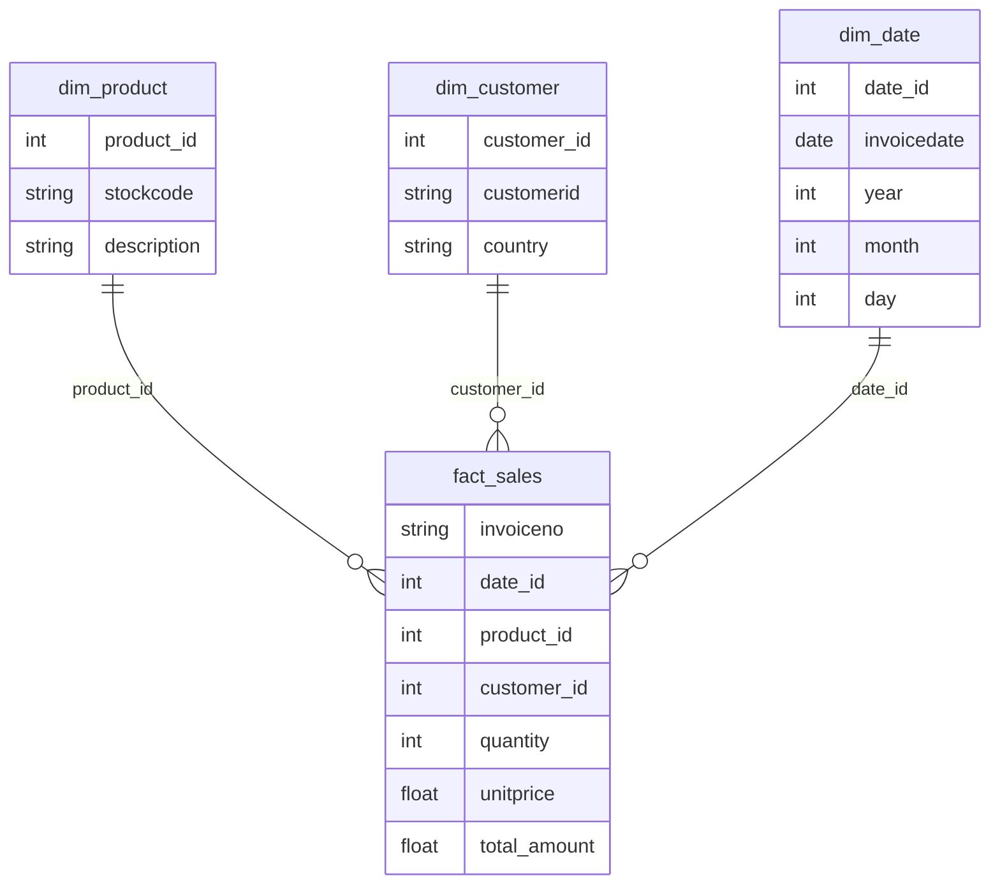
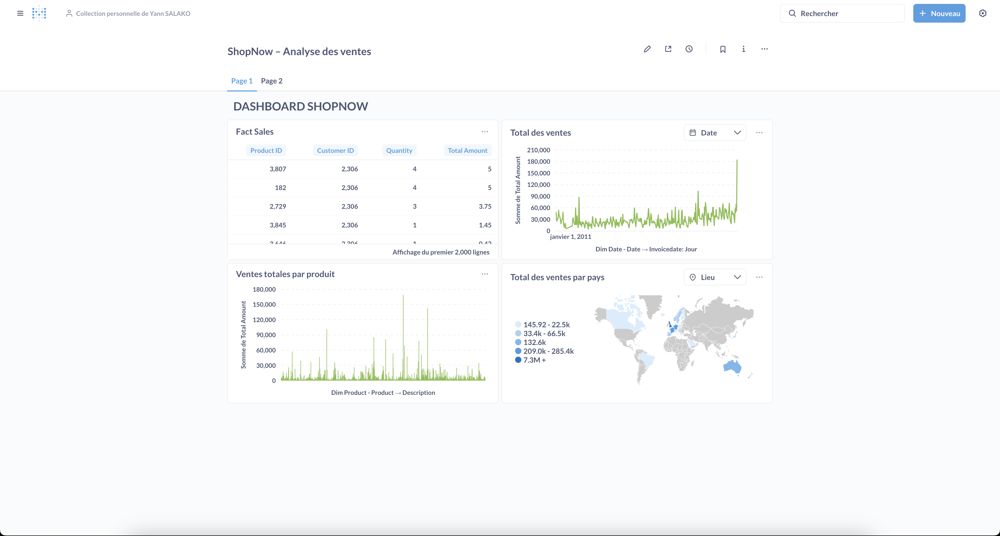
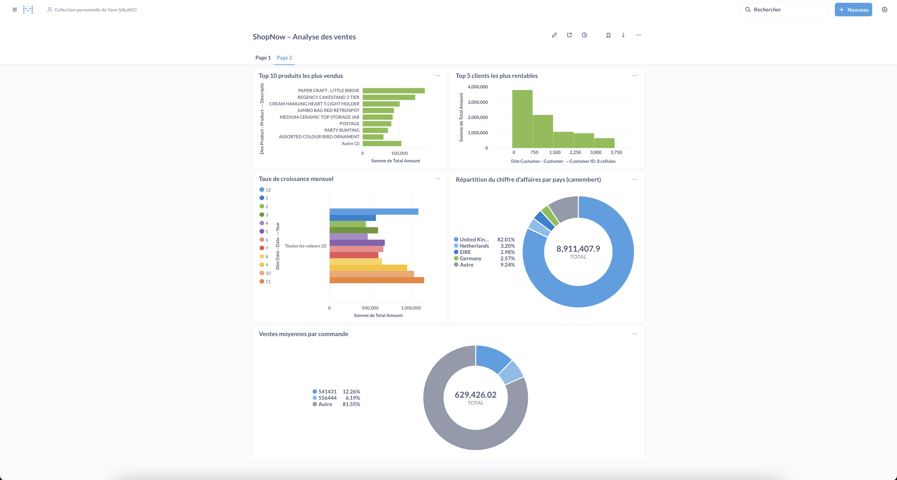

# 🏪 DWH ShopNow — Entrepôt de données E-commerce (PostgreSQL + Python + Prefect + Metabase)


---

### 🚀 Projet complet de Data Engineering & Business Intelligence
Ce projet illustre la création d’un **entrepôt de données complet** à partir de données brutes CSV issues d’une activité e-commerce.  
L’objectif : **centraliser, transformer et analyser les ventes** à travers un pipeline **ETL automatisé** et un **dashboard interactif** sous Metabase.

---

## 🧠 Objectifs du projet

- Concevoir une architecture **Data Warehouse** robuste et scalable  
- Mettre en place un **pipeline ETL Python** (Extraction → Transformation → Chargement)  
- **Orchestrer** le pipeline avec Prefect (retries, planification, alerting)  
- **Conteneuriser** toute la stack (PostgreSQL, ETL, Metabase) avec Docker Compose  
- **Contrôler la qualité** du DWH à chaque exécution  
- Structurer les données selon un **modèle en étoile**  
- Créer un **dashboard analytique** permettant de suivre les KPIs e-commerce :  
  - Chiffre d’affaires total et mensuel  
  - Top produits / pays / clients  
  - Panier moyen  
  - Répartition géographique des ventes  

---

## 🧩 Architecture générale

```
                 ┌──────────────── Prefect flow « shopnow-etl » ────────────────┐
data.csv  →  init_schemas → read_data → clean_data → load_to_staging → build_dwh → check_dwh
                                                          ↓                ↓
                                              staging.retail_cleaned   dwh.fact_sales + dwh.dim_*
                 └──────────── on_completion / on_failure → webhook ────────────┘
                                                                           ↓
                                                                 Metabase (Docker)
                                                                           ↓
                                                                 Tableau de bord BI
```

| Tâche | Rôle | Retries |
|---|---|---|
| `init_schemas` | Crée les schémas `staging` et `dwh` si besoin | 3 |
| `read_data` | Lit le CSV brut (541 909 lignes) | — |
| `clean_data` | Supprime nulls, quantités/prix ≤ 0, typage des dates | — |
| `load_to_staging` | Charge `staging.retail_cleaned` (397 884 lignes) | 3 |
| `build_dwh` | Construit les dimensions puis la table de faits (PK/FK) | 3 |
| `check_dwh` | Vérifie 1 ligne de fait par ligne de staging et l'unicité des produits | — |

---

## 📊 Modèle en étoile (Mermaid Diagram)


```mermaid
erDiagram
    dim_product {
        int product_id
        string stockcode
        string description
    }
    dim_customer {
        int customer_id
        string customerid
        string country
    }
    dim_date {
        int date_id
        date invoicedate
        int year
        int month
        int day
    }
    fact_sales {
        string invoiceno
        int date_id
        int product_id
        int customer_id
        int quantity
        float unitprice
        float total_amount
    }
    dim_product ||--o{ fact_sales : "product_id"
    dim_customer ||--o{ fact_sales : "customer_id"
    dim_date ||--o{ fact_sales : "date_id"
```

---

## ⚙️ Stack Technique

| Domaine | Technologies |
|----------|--------------|
| **ETL / Ingestion** | Python · Pandas · SQLAlchemy |
| **Orchestration** | Prefect 3 (tasks, retries, planification cron, hooks d'alerting) |
| **Stockage / DWH** | PostgreSQL 16 (modèle en étoile, PK/FK) |
| **Visualisation / BI** | Metabase |
| **DevOps / Environnement** | Docker · Docker Compose · variables d'environnement (`.env`) |

---

## 📦 Structure du projet

```
dwh-shopnow/
│
├── data/
│   └── data.csv                      # Fichier source brut
│
├── etl/
│   └── main.py                       # Première version du script ETL (sans orchestration)
│
├── etl_prefect.py                    # Pipeline ETL orchestré avec Prefect
├── Dockerfile                        # Image de l'ETL
├── docker-compose.yml                # PostgreSQL + ETL + Metabase
├── .env.example                      # Variables d'environnement à copier en .env
│
├── docs/
│   └── dashboard_shopnow_page*.png   # Captures du dashboard Metabase
│
├── README.md                         # Présentation du projet
```

---

## 🔁 Pipeline ETL

### Étapes principales :
1. **Extraction** : lecture du fichier CSV `data.csv`  
2. **Chargement brut** : insertion dans `staging.sales_raw`  
3. **Nettoyage / Transformation** :
   - Suppression des doublons et valeurs nulles  
   - Normalisation des champs (`invoicedate`, `unitprice`, etc.)  
4. **Modélisation** :
   - Création des dimensions `dim_product`, `dim_customer`, `dim_date`
   - Calcul du montant total (`quantity * unitprice`)
5. **Chargement final** :
   - Insertion dans `dwh.fact_sales`
   - Relations entre faits et dimensions  

---

## 📊 Dashboard Metabase : *ShopNow – Analyse des ventes*




### Indicateurs clés :
- 💰 **Total des ventes par mois**  
- 🌍 **Répartition des ventes par pays**  
- 🏆 **Top 10 produits les plus vendus**  
- 👥 **Top 5 clients les plus rentables**  
- 🛒 **Panier moyen par commande**  
- 📈 **Croissance mensuelle du chiffre d’affaires**

---

## 🧰 Commandes utiles

### Lancer toute la stack avec Docker Compose :
```bash
cp .env.example .env              # puis renseigner le mot de passe
docker compose up -d postgres metabase
docker compose run --rm etl       # exécute le flow Prefect une fois
```
Metabase est ensuite disponible sur http://localhost:3000 (hôte PostgreSQL : `postgres`, port `5432`).

### Lancer l’ETL en local (sans Docker) :
```bash
pip install -r requirements.txt
python etl_prefect.py
```

### Planifier et alerter :
- `SCHEDULE_CRON="0 6 * * *"` : le flow est servi par Prefect et s'exécute tous les jours à 6h
- `ALERT_WEBHOOK_URL=<url>` : notification (Slack, Discord, Teams…) à chaque fin de run, succès ou échec

### Se connecter à PostgreSQL :
```bash
psql -h localhost -p 5433 -U shopnow -d dw_shopnow
```

---

## 💬 Résultats

✅ **541 909** lignes brutes → **397 884** lignes nettoyées et chargées  
✅ Modèle en étoile : **3 665** produits · **4 338** clients · **305** jours · **397 884** faits  
✅ Contrôle qualité automatique à chaque run (aucune ligne perdue ni dupliquée par les jointures)  
✅ Stack entièrement conteneurisée et reproductible (`docker compose`)  
✅ Orchestration Prefect avec retries, planification et alerting webhook  
✅ Dashboard BI interactif sous Metabase  

---

## 🧑‍💻 Auteur

**Yann SALAKO**  
Data Engineer  
📍 Basé à Angers  
🔗 [LinkedIn](https://www.linkedin.com/in/yann-salako)

---

## ⭐ Si ce projet t’a inspiré
N’hésite pas à :
- Mettre une **⭐️ star** sur le repo  
- Forker pour créer ton propre DWH analytique  
- Me contacter pour en discuter 🚀  

---

## 📄 License
Ce projet est distribué sous la licence **MIT**.  
Tu es libre de le réutiliser, le modifier et le partager à des fins d'apprentissage.

---
